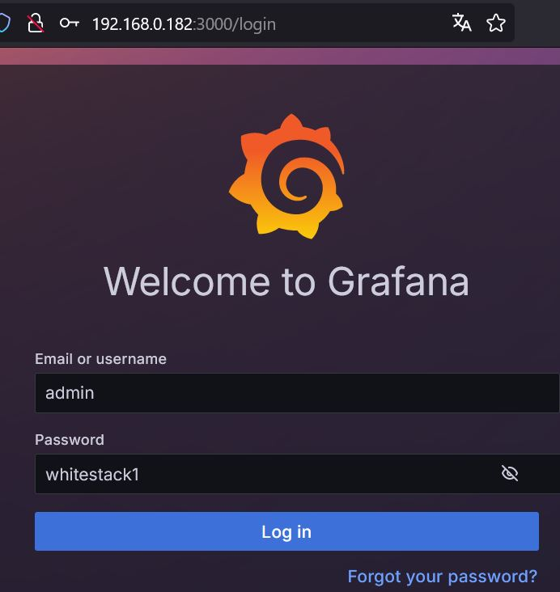
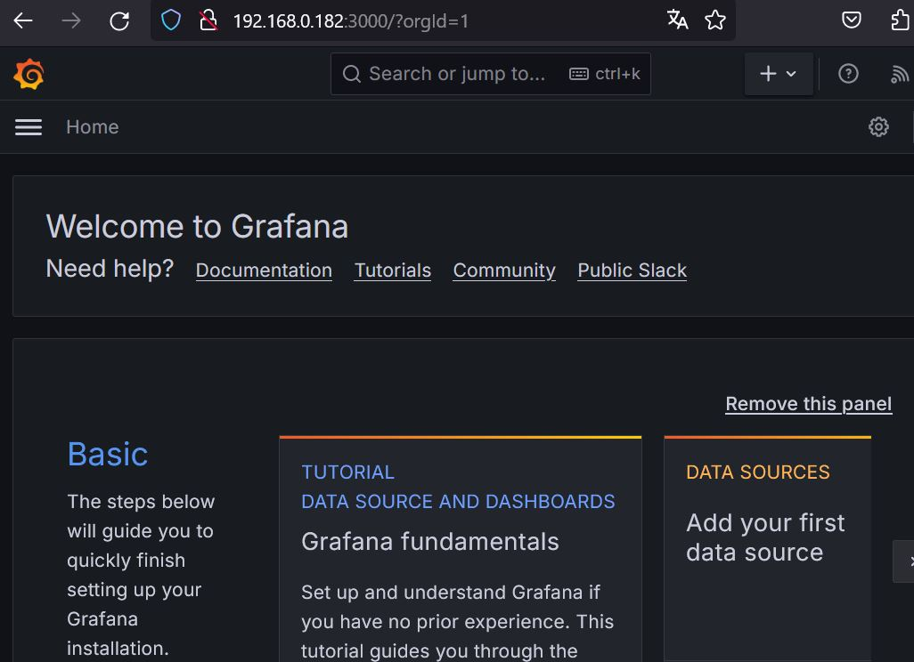

# CHALLENGE 05  PASO 3: Crear Helm Plugin para validación y configuración de información sensible

## ESTRUCTURA DEL CHART

Para realizar este paso hemos creado en el chart un sudbdirectorio llamado `paso03kustomize`. Esto es necesario porque vamos a usar kustomize y no queremos interferir con el script de kustomize que fue creado para el paso 1 y que está en el directorio principal. No ha habido cambios a los archivos del directorio principal. La nueva estructura del chart se ve a continuación:
```
ubuntu@lubuntu:~/challenge05/grafanachart$ tree
.
├── Chart.yaml
├── kustomization.yaml
├── kustomize.sh
├── paso03kustomize
│   ├── base.yaml
│   ├── kustomization.yaml
│   ├── kustomize.sh
│   ├── patch-deployment.yaml
│   └── patch-secret.yaml
├── patch.yaml
├── templates
│   ├── grafanadeploy.yaml
│   └── grafanasvc.yaml
└── values.yaml
```

## ESTRUCTURA DEL PLUGIN "SENSITIVE DATA"

Los archivos de este plugin se encuentran disponibles en este git y en este directorio [sensitivedata](sensitivedata). El plugin está compuesto de 2 archivos como se muestra:
```
ubuntu@lubuntu:~/sensitivedata$ tree
.
├── plugin.yaml
└── script.sh

0 directories, 2 files
```

El archivo [plugin.yaml](sensitivedata/plugin.yaml) es obligatorio. Notar que este archivo llama a ejecutar el archivo "script.sh".  También es importante resaltar que hay un "hook" que otorga permisos de ejecución al archivo "script.sh" debido a que es algo muy común el problema de no poder ejecutar un script debido a falta de permisos.
```
name: "sensitivedata"
version: "0.1.0"
usage: "helm sensitivedata -d <chart dir>"
description: "This plugin is used to check and enforce password complexity. Also to enforce the use of secrets"
ignoreFlags: false
command: "$HELM_PLUGIN_DIR/script.sh"
hooks:
  install: "chmod +x $HELM_PLUGIN_DIR/script.sh"
```

El plugin necesita que declaremos el valor del directorio del chart. A continuación un ejemplo de su uso

```
ubuntu@lubuntu:~$ helm sensitivedata -d ./challenge05/grafanachart
```

## REQUISITO DE PASSWORD COMPLEXITY

Cumplimos este requisito con la función enforce_passcomplexity del archivo [script.sh](sensitivedata/script.sh)  Dicha función usa el comando "yq" para parsear el archivo "values.yaml" del chart y extraer los keys cuyo nombre termine en "pass" o en "credentials" o en "passwords" o en "pwd".

Los values de dichas keys se almacenan en el array llamado my_array. Si es que alguno de los keys no existe entonces el value será "null".  El script ignora los values "null". El resto de values se analizan para ver si cumplen las políticas  de tener por lo menos 8 caracteres, por lo menos 1 mayúscula, por lo menos 1 minúscula, por lo menos 1 dígito, por lo menos algunos caracteres especiales. Usamos un "if" para cada verificación de política. En cada "if" se compara el value con un regex. En caso no cumple con alguna de esas políticas el script da un mensaje de error y termina el script con el comando "exit 1".

A continuación mostramos el extracto del script con dicha función. 

```
enforce_passcomplexity() {
    my_array=( $( yq '.deploy.containers.env' $chart_dir/values.yaml | yq '.*pass,.*credentials,.*passwords,.*pwd' ))
    echo
    len=${#my_array[@]}
 
    ## Use bash for loop 
    for (( i=0; i<$len; i++ ))
    do 
      myvar=${my_array[$i]}
      if [ $myvar != null ] ; then
         if [ ${#myvar} -lt 8 ]; then
           echo "Password has below  than 8 characters. Aborting chart installation"
           exit 1
         else
           echo "Policy enforced. Password has 8 or more characters"
           if [[ ! $myvar =~ [A-Z] ]]; then
             echo "Password does not contain an uppercase letter. Aborting chart installation"
             exit 1
           else
             echo "Policy enforced. Password contains at least one uppercase letter."
             if [[ ! $myvar =~ [a-z] ]]; then
               echo "Password does not contain a lowercase letter. Aborting chart installation"
               exit 1
             else
               echo "Policy enforced. Password contains at least one lowercase letter."
               if [[ ! $myvar =~ [0-9] ]]; then
                 echo "Password does not contain a digit. Aborting chart installation"
                 exit 1
               else
                 echo "Policy enforced. Password contains at least one digit."
                 if [[ ! $myvar =~ ['!@#$%^&*()_+'] ]]; then
                   echo "Password does not contain one of the following  !@#$%^&*()_+ special characters. Aborting chart installation"
                   exit 1
                 else
                   echo "Policy enforced. Password contains at least one of the following  !@#$%^&*()_+ special characters."
                 fi
               fi
             fi
           fi
         fi
      fi
    done
```

## VERIFICACIÓN DE PASSWORD COMPLEXITY

Usamos el key "adminpass" en el archivo values.yaml cuyo valor es whitestack y verificamos que no se cumple la política de tener al menos una mayúscula.

```
ubuntu@lubuntu:~$ more challenge05/grafanachart/values.yaml | grep adminpass:
          adminpass: whitestack

ubuntu@lubuntu:~$ helm sensitivedata -d ./challenge05/grafanachart

Policy enforced. Password has 8 or more characters
Password does not contain an uppercase letter. Aborting chart installation
Error: plugin "sensitivedata" exited with error
```

Ahora probamos cuando el key "adminpass" tiene el valor Whitestack1 y verificamos que no se cumple la política de caracteres especiales
```
ubuntu@lubuntu:~$ more challenge05/grafanachart/values.yaml | grep adminpass:
          adminpass: Whitestack1

ubuntu@lubuntu:~$ helm sensitivedata -d ./challenge05/grafanachart

Policy enforced. Password has 8 or more characters
Policy enforced. Password contains at least one uppercase letter.
Policy enforced. Password contains at least one lowercase letter.
Policy enforced. Password contains at least one digit.
Password does not contain one of the following  !@#$%^&*()_+ special characters. Aborting chart installation
Error: plugin "sensitivedata" exited with error
```

Ahora probamos cuando el key "adminpass" tiene el valor Whitestack1! y verificamos que todas las políticas de password complexity se cumplen
```
ubuntu@lubuntu:~$ more challenge05/grafanachart/values.yaml | grep adminpass:
          adminpass: Whitestack1!

ubuntu@lubuntu:~$ helm sensitivedata -d ./challenge05/grafanachart

Policy enforced. Password has 8 or more characters
Policy enforced. Password contains at least one uppercase letter.
Policy enforced. Password contains at least one lowercase letter.
Policy enforced. Password contains at least one digit.
Policy enforced. Password contains at least one of the following  !@#$%^&*()_+ special characters.
```

## REQUISITO DE CREAR Y USAR SECRET

Revisamos el extracto de abajo script.sh del plugin sensitivedata. Podemos ver quue el script acepta argumentos. En particular nos interesa el argumento -d que permite declarar el directorio donde se encuentra el chart.  Vemos la línea `enforce_passwordcomplexity $chart_dir` que es la que llama a la función  que revisamos en la sección anterior.
Luego está la línea `myname=$(yq '.deploy.name' $chart_dir/values.yaml)` para capturar el nombre del deployment.
La línea `cd $chart_dir/paso03kustomize` cambia el working directory al directorio donde están los archivos usados por kustomize.
Y la línea `helm install $myname .. --post-renderer ./kustomize.sh` es la que llamará al script "kustomize.sh" y luego instalará el chart. Más abajo explicaremos la lógica que usamos en kustomize.

```
while [[ "$#" -gt 0 ]]; do
    case $1 in
        -h|--help) display_help; shift ;;
        -d| --dir*)
        if ! has_argument $@; then
          echo "Chart directory not specified." >&2
          display_help
          exit 1
        fi
        chart_dir=$(extract_argument $@)
        enforce_passcomplexity $chart_dir

        myname=$(yq '.deploy.name' $chart_dir/values.yaml)
        cd $chart_dir/paso03kustomize
        helm install $myname .. --post-renderer ./kustomize.sh

        shift ;;
        *) echo "Unknown parameter passed: $1"; display_help ;;
    esac
    shift
```
Revisemos los archivos del subdirectorio `paso03kustomize`

```
ubuntu@lubuntu:~/challenge05/grafanachart/paso03kustomize$ tree
├── base.yaml
├── kustomization.yaml
├── kustomize.sh
├── patch-deployment.yaml
└── patch-secret.yaml
```

Recordemos que nuestro chart sólo tiene un recurso "deployment" y un recurso "service". El archivo "base.yaml" contiene la base de un recurso "secret". Esto es importante porque luego vamos  a usar "kustomize" para hacer un "patch" con el archivo "path-secret.yaml". El "patch" no funcionará a menos que le haga match a un recurso ya existente y eso es lo que nos ofrecerá el archivo "base.yaml".

```
ubuntu@lubuntu:~/challenge05/grafanachart/paso03kustomize$ more base.yaml 
apiVersion: v1
kind: Secret
metadata:
  name: mysecret
```

Ahora revisemos el archivo "kustomize.sh". Vemos que copia el archivo "base.yaml" a "pivot.yaml".  Luego la línea `cat >> pivot.yaml` lo que hace es recibir el resultado del comando `helm install $myname .. --post-renderer ./kustomize.sh` del archivo "script.sh" (el que hemos revisado líneas arriba). El efecto es que "pivot.yaml" recibirá los recursos "deployment", "service" del chart y del recurso "secret" de "base.yaml". Es decir "pivot.yaml" acumula todos los recursos. Luego la línea `exec kubectl kustomize| envsubst ` ejecuta kustomize , lo cual por defecto usa el archivo "kustomization.yaml" que veremos más abajo. Vemos también que dicha línea usa la herramienta "envsubst" Esto es para reemplazar la environment variable ${mypass_base64} que se mostrará más abajo en el archivo "patch-secret.yaml".

```
ubuntu@lubuntu:~/challenge05/grafanachart/paso03kustomize$ more kustomize.sh 
#!/bin/sh
cp base.yaml pivot.yaml
cat >> pivot.yaml
# you can also use "kustomize build ." if you have it installed.
exec kubectl kustomize| envsubst 
rm pivot.yaml
```

Ahora revisemos el archivo "kustomization.yaml". Vemos que toma como base al archivo "pivot.yaml" y luego ejecutará "patches" (es decir se hará merge) con los archivos "path-secret.yaml" y "path-deployment.yaml"
```
ubuntu@lubuntu:~/challenge05/grafanachart/paso03kustomize$ more kustomization.yaml 
resources:
- pivot.yaml

patches:
- path: patch-secret.yaml
- path: patch-deployment.yaml
```

Veamos el archivo "path-secret.yaml". Este parche agregará el recurso "secret" con un key "GF_SECURITY_ADMIN_PASSWORD" y con un value ${mypass_base64} el cual tomará su valor de una variable de entorno.

```
ubuntu@lubuntu:~/challenge05/grafanachart/paso03kustomize$ more patch-secret.yaml 
apiVersion: v1
kind: Secret
metadata:
  name: mysecret
type: Opaque
data:
  GF_SECURITY_ADMIN_PASSWORD: ${mypass_base64}
```


Veamos el archivo "path-deployment.yaml". Este parche hará un merge con el recurso "deployment". Notar la línea `value: null`  . Lo que hace dicha línea es remover dicho campo. Ahora notar las líneas `valueFrom:` , `secretKeyRef:` que harán que el password sea obtenido del key "GF_SECURITY_ADMIN_PASSWORD" que se encuentra en el secret llamado "mysecret" con lo cual se cumple los requerimientos que nos pidieron en esta sección.

```
ubuntu@lubuntu:~/challenge05/grafanachart/paso03kustomize$ more patch-deployment.yaml 
apiVersion: apps/v1
kind: Deployment
metadata:
  name: grafana
spec:
  template:
    spec:
      containers:
        - name: grafana
          env:
          - name: GF_SECURITY_ADMIN_PASSWORD
            value: null
            valueFrom:
              secretKeyRef:
                name: mysecret
                key: GF_SECURITY_ADMIN_PASSWORD

```

## VERIFICACIÓN DE CREAR Y USAR SECRET

Antes de ejecutar el plugin recordemos que debemos definir la variabla de entorno  ${mypass_base64} para darle un valor al key del recurso "mysecret". Asignamos dicho valor usando el comando "export" como lo vemos abajo. Notar que el password que usamos en este ejemplo es "whitestack". Notar que es necesario convertirlo a base64 debido a que dicho formato es el que se usa en el secret

```
export mypass_base64=`echo -n whitestack1| base64`
```

Ahora podemos ejecutar el plugin
```
ubuntu@lubuntu:~$ helm sensitivedata -d challenge05/grafanachart

Policy enforced. Password has 8 or more characters
Policy enforced. Password contains at least one uppercase letter.
Policy enforced. Password contains at least one lowercase letter.
Policy enforced. Password contains at least one digit.
Policy enforced. Password contains at least one of the following  !@#$%^&*()_+ special characters.
NAME: grafana
LAST DEPLOYED: Fri Sep  6 15:40:52 2024
NAMESPACE: challenger-004
STATUS: deployed
REVISION: 1
TEST SUITE: None
```

Revisemos el recurso mysecret. Vemos que el key "GF_SECURITY_ADMIN_PASSWORD" tiene el valor "d2hpdGVzdGFjazE="
```
ubuntu@lubuntu:~$ kubectl get secret/mysecret -oyaml
Warning: Use tokens from the TokenRequest API or manually created secret-based tokens instead of auto-generated secret-based tokens.
apiVersion: v1
data:
  GF_SECURITY_ADMIN_PASSWORD: d2hpdGVzdGFjazE=
kind: Secret
metadata:
  annotations:
    meta.helm.sh/release-name: grafana
    meta.helm.sh/release-namespace: challenger-004
  creationTimestamp: "2024-09-08T20:46:24Z"
  labels:
    app.kubernetes.io/managed-by: Helm
  name: mysecret
  namespace: challenger-004
  resourceVersion: "107790938"
  uid: 50ca853f-aa53-4106-8a7b-18edd9874824
type: Opaque
```
Recordemos que el valor "d2hpdGVzdGFjazE=" está en formato base64. Lo decodificamos y comprobamos que el password original es "whitestack1"

```
ubuntu@lubuntu:~$ echo -n "d2hpdGVzdGFjazE=" | base64 --decode
whitestack1
```
Revisemos que todos los pods usan el key "GF_SECURITY_ADMIN_PASSWORD" de "mysecret"
```
ubuntu@lubuntu:~$ kubectl get pod
NAME                       READY   STATUS    RESTARTS   AGE
grafana-5f8f5b77d5-g9pb7   1/1     Running   0          2m15s
grafana-5f8f5b77d5-nzh42   1/1     Running   0          2m15s
grafana-5f8f5b77d5-sxmhx   1/1     Running   0          2m15s

ubuntu@lubuntu:~$ kubectl describe pod | grep -A 1 Env
    Environment:
      GF_SECURITY_ADMIN_PASSWORD:  <set to the key 'GF_SECURITY_ADMIN_PASSWORD' in secret 'mysecret'>  Optional: false
--
    Environment:
      GF_SECURITY_ADMIN_PASSWORD:  <set to the key 'GF_SECURITY_ADMIN_PASSWORD' in secret 'mysecret'>  Optional: false
--
    Environment:
      GF_SECURITY_ADMIN_PASSWORD:  <set to the key 'GF_SECURITY_ADMIN_PASSWORD' in secret 'mysecret'>  Optional: false
```

Ahora hacemos port-forward para probar el acceso http al servicio de Grafana
```
ubuntu@lubuntu:~$ kubectl port-forward svc/grafana 3000 --address="0.0.0.0"
Warning: Use tokens from the TokenRequest API or manually created secret-based tokens instead of auto-generated secret-based tokens.
Forwarding from 0.0.0.0:3000 -> 3000
Handling connection for 3000
Handling connection for 3000
Handling connection for 3000
```

Ingresamos por http a la IP de nuestra PC local con puerto 3000. Aparece la página de login. Ingresamos el usuario admin con password whitestack1


En la siguiente figura comprobamos que se aceptó el login y se ha ingresado exitosamente a Grafana con el password whitestack1 



